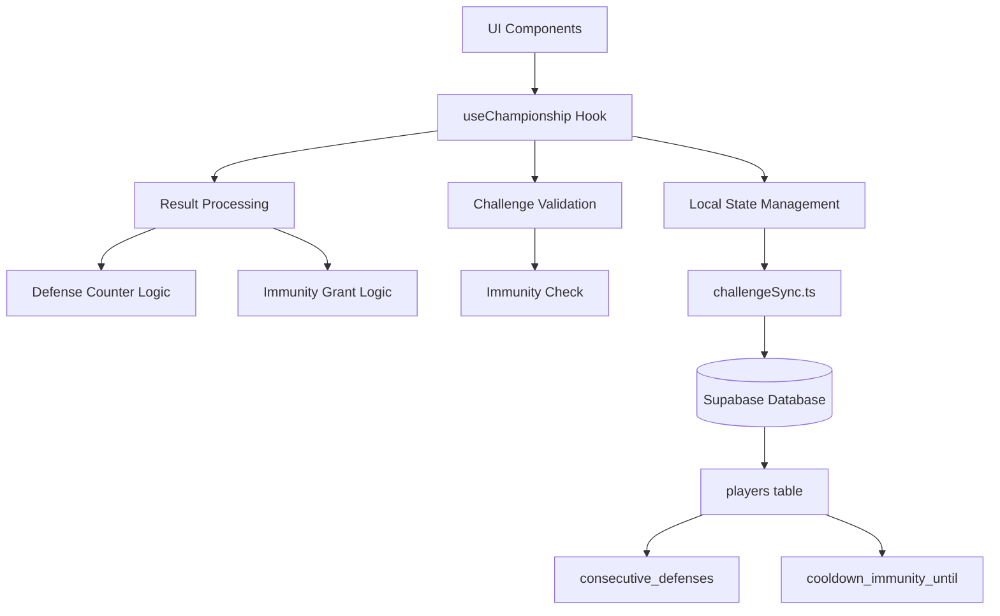
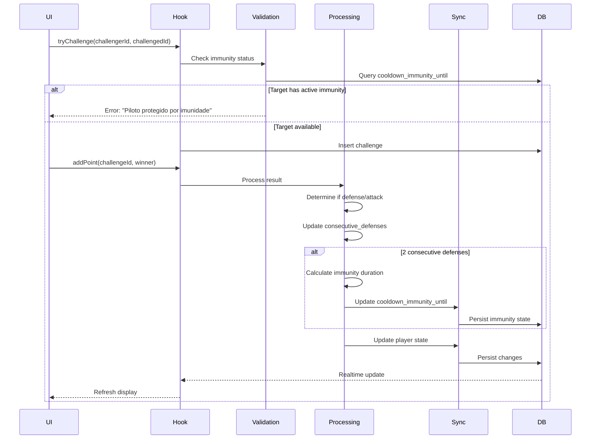
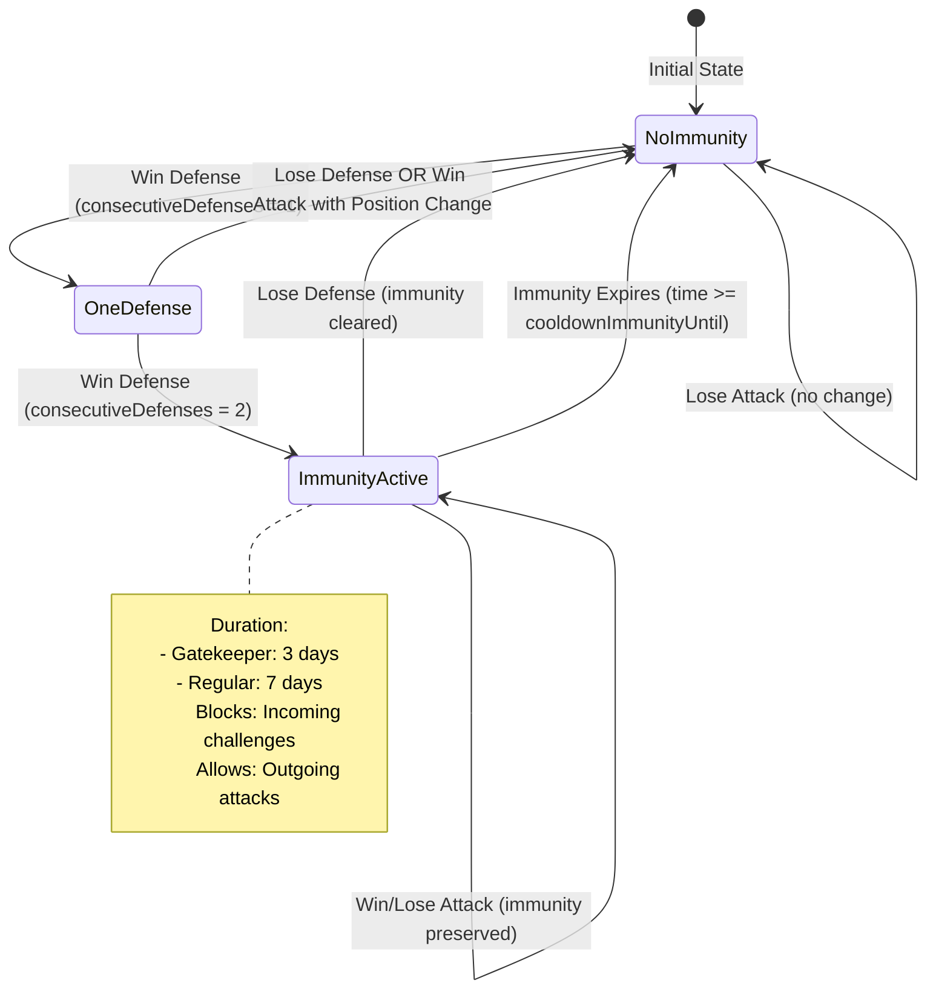
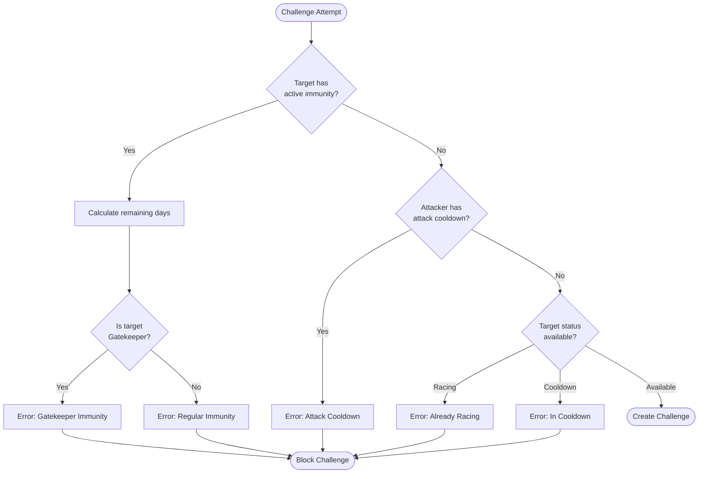
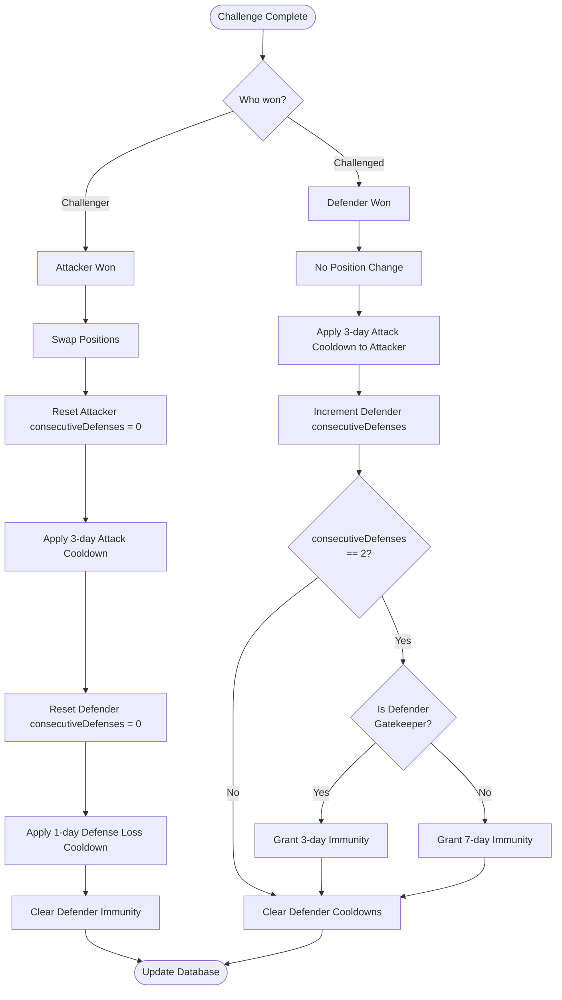

# Design Document: Defensive Immunity System

## Overview

The Defensive Immunity System is a strategic feature for the Midnight Club ranking system that rewards pilots who successfully defend their positions multiple times consecutively. The system tracks consecutive defense victories and grants temporary immunity from challenges, creating breathing room for pilots under heavy attack pressure while maintaining their offensive freedom.

### Key Design Principles

1. **Defensive Reward**: Pilots earn immunity after 2 consecutive successful defenses
2. **Position-Based Duration**: Gatekeeper (8º Lista 02) receives 3 days immunity; regular pilots receive 7 days
3. **Offensive Freedom**: Immunity only blocks incoming challenges; pilots can still attack others
4. **State Persistence**: All immunity state is synchronized with the Supabase database
5. **Challenge Type Awareness**: System differentiates between ladder, initiation, and Desafio_Vaga challenges

### System Context

The Defensive Immunity System integrates with:
- **Database Layer**: PostgreSQL (Supabase) for persistent state storage
- **Frontend State**: React hooks (`useChampionship`) for real-time UI updates
- **Challenge System**: Validation logic in challenge creation functions
- **Sync Layer**: `challengeSync.ts` for database synchronization

---

## Architecture

### Component Diagram



### Data Flow



---

## Components and Interfaces

### 1. Database Schema Changes

#### Migration SQL

```sql
-- Add consecutive_defenses column to track defense wins
ALTER TABLE public.players 
ADD COLUMN IF NOT EXISTS consecutive_defenses INTEGER DEFAULT 0;

-- Add cooldown_immunity_until column to track immunity expiration
ALTER TABLE public.players 
ADD COLUMN IF NOT EXISTS cooldown_immunity_until TIMESTAMPTZ;

-- Add index for immunity queries (performance optimization)
CREATE INDEX IF NOT EXISTS idx_players_immunity 
ON public.players(cooldown_immunity_until) 
WHERE cooldown_immunity_until IS NOT NULL;

-- Add index for defense counter queries
CREATE INDEX IF NOT EXISTS idx_players_consecutive_defenses 
ON public.players(consecutive_defenses) 
WHERE consecutive_defenses > 0;

-- Add comment for documentation
COMMENT ON COLUMN public.players.consecutive_defenses IS 
'Number of consecutive successful defenses. Reset to 0 on loss or position change.';

COMMENT ON COLUMN public.players.cooldown_immunity_until IS 
'Timestamp until which the pilot cannot be challenged. NULL means no immunity.';
```

#### Rollback SQL (if needed)

```sql
-- Remove indexes
DROP INDEX IF EXISTS idx_players_immunity;
DROP INDEX IF EXISTS idx_players_consecutive_defenses;

-- Remove columns
ALTER TABLE public.players DROP COLUMN IF EXISTS consecutive_defenses;
ALTER TABLE public.players DROP COLUMN IF EXISTS cooldown_immunity_until;
```

### 2. TypeScript Interface Updates

#### Player Interface (`src/types/championship.ts`)

```typescript
export interface Player {
  id: string;
  name: string;
  status: 'available' | 'racing' | 'cooldown' | 'pending';
  defenseCount: number;
  cooldownUntil: number | null;
  challengeCooldownUntil: number | null;
  initiationComplete: boolean;
  defensesWhileSeventhStreak: number;
  list02ExternalBlockUntil: number | null;
  list02ExternalEligibleAfter: number | null;
  elegivelDesafioVaga?: boolean;
  
  // NEW: Immunity system properties
  /** Number of consecutive successful defenses */
  consecutiveDefenses: number;
  /** Timestamp (ms) until which pilot cannot be challenged. NULL = no immunity */
  cooldownImmunityUntil: number | null;
}
```

#### Database Conversion Function (`src/hooks/useChampionship.ts`)

```typescript
function dbPlayerToLocal(row: any): Player {
  return {
    id: row.id,
    name: row.name,
    status: row.status as Player['status'],
    defenseCount: row.defense_count ?? 0,
    cooldownUntil: row.cooldown_until ? new Date(row.cooldown_until).getTime() : null,
    challengeCooldownUntil: row.challenge_cooldown_until 
      ? new Date(row.challenge_cooldown_until).getTime() 
      : null,
    initiationComplete: row.initiation_complete ?? false,
    defensesWhileSeventhStreak: row.defenses_while_seventh_streak ?? 0,
    list02ExternalBlockUntil: row.list02_external_block_until
      ? new Date(row.list02_external_block_until).getTime()
      : null,
    list02ExternalEligibleAfter: row.list02_external_eligible_after
      ? new Date(row.list02_external_eligible_after).getTime()
      : null,
    elegivelDesafioVaga: row.elegivel_desafio_vaga ?? false,
    
    // NEW: Convert immunity fields
    consecutiveDefenses: row.consecutive_defenses ?? 0,
    cooldownImmunityUntil: row.cooldown_immunity_until
      ? new Date(row.cooldown_immunity_until).getTime()
      : null,
  };
}
```

### 3. Business Logic Constants

```typescript
// Existing cooldowns
const COOLDOWN_ATAQUE = 3 * 24 * 60 * 60 * 1000; // 3 days - attacker cooldown
const COOLDOWN_DEFESA_DERROTA = 1 * 24 * 60 * 60 * 1000; // 1 day - defender loss cooldown

// NEW: Immunity durations
const IMMUNITY_GATEKEEPER_MS = 3 * 24 * 60 * 60 * 1000; // 3 days for Gatekeeper
const IMMUNITY_REGULAR_MS = 7 * 24 * 60 * 60 * 1000; // 7 days for regular pilots
```

---

## Data Models

### Player State Model

```typescript
interface PlayerImmunityState {
  consecutiveDefenses: number;      // 0, 1, 2, ... (resets on loss or position change)
  cooldownImmunityUntil: number | null;  // Unix timestamp in ms, or null
}
```

### Challenge Result Context

```typescript
interface ChallengeResultContext {
  challengeId: string;
  challengerId: string;
  challengedId: string;
  challengerPos: number;
  challengedPos: number;
  listId: string;
  type: 'ladder' | 'initiation' | 'friendly' | 'desafio-vaga';
  winner: 'challenger' | 'challenged';
  isPositionSwap: boolean;  // Did positions change?
}
```

---

## Correctness Properties

*A property is a characteristic or behavior that should hold true across all valid executions of a system—essentially, a formal statement about what the system should do. Properties serve as the bridge between human-readable specifications and machine-verifiable correctness guarantees.*


### Property Reflection

After analyzing all acceptance criteria, I identified the following properties that can be consolidated or are redundant:

**Consolidation Opportunities:**
- Properties 1.1, 1.2, 1.3, 1.4 (defense counter updates) can be combined into a single comprehensive property about counter state transitions
- Properties 2.2, 2.4, 3.2, 3.4 (immunity blocking/allowing challenges) can be combined into a single property about immunity enforcement
- Properties 5.3, 5.5 (immunity preservation during attacks) are redundant - 5.5 subsumes 5.3
- Properties 7.1, 7.2, 7.3 (database synchronization) can be combined into a single property about state persistence

**Final Property Set:**
After consolidation, we have 12 unique properties that provide comprehensive validation coverage without redundancy.

### Property 1: Defense Counter State Transitions

*For any* pilot and challenge result, the consecutive_defenses counter SHALL:
- Increment by 1 when the pilot wins a defense challenge
- Reset to 0 when the pilot loses a defense challenge
- Reset to 0 when the pilot wins an attack and changes position
- Remain unchanged when the pilot loses an attack challenge

**Validates: Requirements 1.1, 1.2, 1.3, 1.4**

### Property 2: Immunity Enforcement

*For any* pilot with active immunity (cooldownImmunityUntil > current time), incoming challenges SHALL be blocked, and *for any* pilot with expired or no immunity (cooldownImmunityUntil ≤ current time or NULL), incoming challenges SHALL be allowed.

**Validates: Requirements 2.2, 2.4, 3.2, 3.4, 4.1, 4.2**

### Property 3: Offensive Freedom During Immunity

*For any* pilot with active immunity (cooldownImmunityUntil > current time), attack challenges initiated by that pilot SHALL be allowed to proceed normally.

**Validates: Requirements 2.3, 3.3, 5.1**

### Property 4: Attack Cooldown Application

*For any* pilot who completes an attack challenge (win or loss), the system SHALL apply a 3-day attack cooldown (challengeCooldownUntil = now + 3 days).

**Validates: Requirements 5.2**

### Property 5: Immunity Preservation During Attacks

*For any* pilot with active immunity who completes an attack challenge (regardless of outcome or position change), the cooldownImmunityUntil timestamp SHALL remain unchanged.

**Validates: Requirements 5.3, 5.5**

### Property 6: Defense Counter Reset on Position Change

*For any* pilot who wins an attack challenge and changes position, the consecutiveDefenses counter SHALL be reset to 0.

**Validates: Requirements 5.4**

### Property 7: Gatekeeper Immunity Grant

*For any* pilot occupying the last position in Lista 02 (Gatekeeper) who wins a defense challenge of type Desafio_Vaga with consecutiveDefenses = 1, the system SHALL set cooldownImmunityUntil = now + 3 days and consecutiveDefenses = 2.

**Validates: Requirements 2.1**

### Property 8: Regular Pilot Immunity Grant

*For any* pilot not occupying the last position in Lista 02 who wins a defense challenge with consecutiveDefenses = 1, the system SHALL set cooldownImmunityUntil = now + 7 days and consecutiveDefenses = 2.

**Validates: Requirements 3.1**

### Property 9: Error Message Formatting

*For any* challenge attempt against a pilot with active immunity, the error message SHALL include the remaining immunity time in days, calculated as ceil((cooldownImmunityUntil - now) / (24 * 60 * 60 * 1000)).

**Validates: Requirements 4.3**

### Property 10: Database State Synchronization

*For any* change to consecutiveDefenses or cooldownImmunityUntil in local state, the corresponding database columns (consecutive_defenses, cooldown_immunity_until) SHALL be updated to match.

**Validates: Requirements 7.1, 7.2, 7.3**

### Property 11: Timestamp Conversion Round-Trip

*For any* TIMESTAMPTZ value in the database cooldown_immunity_until column, converting to local millisecond timestamp and back to TIMESTAMPTZ SHALL preserve the original value (within 1 second precision).

**Validates: Requirements 7.4**

### Property 12: Independent Cooldown Enforcement

*For any* pilot with both challengeCooldownUntil > now (attack cooldown) and cooldownImmunityUntil > now (immunity), both restrictions SHALL be enforced independently: the pilot cannot initiate attacks (attack cooldown) AND cannot receive challenges (immunity).

**Validates: Requirements 8.3**

---

## Error Handling

### Validation Errors

```typescript
// Immunity validation error
interface ImmunityError {
  type: 'IMMUNITY_ACTIVE';
  message: string;  // "Este piloto está protegido por imunidade de defesa. Tempo restante: X dias."
  remainingDays: number;
  targetName: string;
  isGatekeeper: boolean;
}

// Example error messages
const IMMUNITY_ERROR_GATEKEEPER = 
  "Imunidade Gatekeeper ativa: Este piloto defendeu sua posição 2 vezes seguidas.";
const IMMUNITY_ERROR_REGULAR = 
  "Imunidade de Defesa ativa: Este piloto defendeu sua posição 2 vezes seguidas.";
```

### Error Handling Strategy

1. **Challenge Validation**: Check immunity before creating challenge
2. **User Feedback**: Display clear error messages with remaining time
3. **Database Errors**: Log sync failures, maintain local state consistency
4. **Edge Cases**: Handle null/undefined values gracefully

### Error Recovery

- **Sync Failures**: Retry database updates with exponential backoff
- **State Inconsistency**: Fetch fresh state from database on critical operations
- **Invalid Timestamps**: Treat invalid/null timestamps as no immunity

---

## Testing Strategy

### Unit Testing Approach

**Focus Areas:**
- Immunity validation logic (check functions)
- Defense counter update logic (increment/reset)
- Immunity grant calculation (duration based on position)
- Error message formatting
- Timestamp conversion functions

**Example Unit Tests:**
```typescript
describe('Immunity Validation', () => {
  it('should block challenge when target has active immunity', () => {
    const target = { cooldownImmunityUntil: Date.now() + 5 * 24 * 60 * 60 * 1000 };
    const result = checkImmunity(target);
    expect(result.blocked).toBe(true);
    expect(result.remainingDays).toBe(5);
  });

  it('should allow challenge when immunity expired', () => {
    const target = { cooldownImmunityUntil: Date.now() - 1000 };
    const result = checkImmunity(target);
    expect(result.blocked).toBe(false);
  });
});

describe('Defense Counter Updates', () => {
  it('should increment counter on defense win', () => {
    const pilot = { consecutiveDefenses: 1 };
    const updated = processDefenseWin(pilot);
    expect(updated.consecutiveDefenses).toBe(2);
  });

  it('should reset counter on defense loss', () => {
    const pilot = { consecutiveDefenses: 2 };
    const updated = processDefenseLoss(pilot);
    expect(updated.consecutiveDefenses).toBe(0);
  });
});
```

### Property-Based Testing

**Property Test Configuration:**
- Minimum 100 iterations per property test
- Use fast-check or similar PBT library for TypeScript
- Tag each test with feature name and property number

**Property Test Examples:**

```typescript
import fc from 'fast-check';

describe('Property: Defense Counter State Transitions', () => {
  it('Feature: defensive-immunity-system, Property 1: Defense counter transitions correctly', () => {
    fc.assert(
      fc.property(
        fc.record({
          consecutiveDefenses: fc.integer({ min: 0, max: 10 }),
          challengeType: fc.constantFrom('defense-win', 'defense-loss', 'attack-win-swap', 'attack-loss'),
        }),
        ({ consecutiveDefenses, challengeType }) => {
          const pilot = { consecutiveDefenses };
          const result = processChallenge Result(pilot, challengeType);
          
          switch (challengeType) {
            case 'defense-win':
              return result.consecutiveDefenses === consecutiveDefenses + 1;
            case 'defense-loss':
            case 'attack-win-swap':
              return result.consecutiveDefenses === 0;
            case 'attack-loss':
              return result.consecutiveDefenses === consecutiveDefenses;
          }
        }
      ),
      { numRuns: 100 }
    );
  });
});

describe('Property: Immunity Enforcement', () => {
  it('Feature: defensive-immunity-system, Property 2: Immunity blocks/allows challenges correctly', () => {
    fc.assert(
      fc.property(
        fc.record({
          cooldownImmunityUntil: fc.option(fc.integer({ min: Date.now() - 10000, max: Date.now() + 10000 }), { nil: null }),
        }),
        ({ cooldownImmunityUntil }) => {
          const pilot = { cooldownImmunityUntil };
          const now = Date.now();
          const result = validateChallenge(pilot, now);
          
          const hasActiveImmunity = cooldownImmunityUntil !== null && cooldownImmunityUntil > now;
          return result.blocked === hasActiveImmunity;
        }
      ),
      { numRuns: 100 }
    );
  });
});
```

### Integration Testing

**Database Integration:**
- Test full challenge flow with database persistence
- Verify immunity state survives page refresh
- Test concurrent challenge attempts

**UI Integration:**
- Test immunity badge display
- Test error message display
- Test tooltip interactions

### Test Coverage Goals

- **Unit Tests**: 90%+ coverage of immunity logic
- **Property Tests**: All 12 correctness properties implemented
- **Integration Tests**: Critical user flows (challenge creation, result processing)
- **E2E Tests**: Full immunity lifecycle (earn → use → expire)

---

## Implementation Details

### Algorithm: Process Challenge Result

This is the core algorithm that runs when a challenge completes (via `addPoint` function).

```typescript
/**
 * Process challenge result and update immunity state
 * 
 * @param challenge - The completed challenge
 * @param winner - 'challenger' or 'challenged'
 * @param lists - Current player lists
 * @returns Updated player states
 */
function processChallenge Result(
  challenge: Challenge,
  winner: 'challenger' | 'challenged',
  lists: PlayerList[]
): { challengerUpdates: Partial<Player>; challengedUpdates: Partial<Player> } {
  
  const list = lists.find(l => l.id === challenge.listId);
  if (!list) throw new Error('List not found');
  
  const challenger = list.players.find(p => p.id === challenge.challengerId);
  const challenged = list.players.find(p => p.id === challenge.challengedId);
  if (!challenger || !challenged) throw new Error('Players not found');
  
  const challengerWon = winner === 'challenger';
  const isPositionSwap = challengerWon; // Positions swap only if challenger wins
  
  // Determine if this was a defense or attack for each player
  const challengerIsAttacker = true; // Challenger is always the attacker
  const challengedIsDefender = true; // Challenged is always the defender
  
  // Initialize updates
  const challengerUpdates: Partial<Player> = {};
  const challengedUpdates: Partial<Player> = {};
  
  // ─── ATTACKER (Challenger) LOGIC ───
  // Attacker always gets 3-day attack cooldown
  challengerUpdates.challengeCooldownUntil = Date.now() + COOLDOWN_ATAQUE;
  
  if (challengerWon) {
    // Attacker won: position changes, reset defense counter
    challengerUpdates.consecutiveDefenses = 0;
    challengerUpdates.status = 'available';
    challengerUpdates.cooldownUntil = null;
    // Immunity is preserved (if exists)
  } else {
    // Attacker lost: no position change, defense counter unchanged
    challengerUpdates.status = 'available';
    challengerUpdates.cooldownUntil = null;
    // consecutiveDefenses unchanged
    // Immunity is preserved (if exists)
  }
  
  // ─── DEFENDER (Challenged) LOGIC ───
  if (challengerWon) {
    // Defender lost: position changes, reset defense counter, 1-day cooldown
    challengedUpdates.consecutiveDefenses = 0;
    challengedUpdates.status = 'cooldown';
    challengedUpdates.cooldownUntil = Date.now() + COOLDOWN_DEFESA_DERROTA;
    challengedUpdates.challengeCooldownUntil = null;
    // Immunity is cleared (lost defense)
    challengedUpdates.cooldownImmunityUntil = null;
  } else {
    // Defender won: no position change, increment defense counter
    const newDefenseCount = challenged.consecutiveDefenses + 1;
    challengedUpdates.consecutiveDefenses = newDefenseCount;
    challengedUpdates.status = 'available';
    challengedUpdates.cooldownUntil = null;
    challengedUpdates.challengeCooldownUntil = null;
    
    // ─── IMMUNITY GRANT LOGIC ───
    if (newDefenseCount === 2) {
      // Check if defender is Gatekeeper
      const isGatekeeper = isPlayerGatekeeper(challenged, list);
      const isDesafioVaga = challenge.type === 'desafio-vaga' || challenge.listId === 'desafio-vaga';
      
      if (isGatekeeper && isDesafioVaga) {
        // Gatekeeper: 3 days immunity
        challengedUpdates.cooldownImmunityUntil = Date.now() + IMMUNITY_GATEKEEPER_MS;
      } else if (!isGatekeeper) {
        // Regular pilot: 7 days immunity
        challengedUpdates.cooldownImmunityUntil = Date.now() + IMMUNITY_REGULAR_MS;
      }
    }
  }
  
  return { challengerUpdates, challengedUpdates };
}

/**
 * Check if a pilot is the Gatekeeper (last position in Lista 02)
 */
function isPlayerGatekeeper(player: Player, list: PlayerList): boolean {
  if (list.id !== 'list-02') return false;
  const lastIdx = getList02LastPlaceIndex(list.players.length);
  const playerIdx = list.players.findIndex(p => p.id === player.id);
  return playerIdx === lastIdx;
}
```

### Algorithm: Validate Challenge Eligibility

This algorithm runs before creating a challenge to check immunity.

```typescript
/**
 * Validate if a challenge can be created
 * 
 * @param challenger - The attacking pilot
 * @param challenged - The defending pilot
 * @param challengeType - Type of challenge
 * @returns Error message if invalid, null if valid
 */
function validateChallengeEligibility(
  challenger: Player,
  challenged: Player,
  challengeType: 'ladder' | 'cross-list' | 'street-runner' | 'desafio-vaga'
): string | null {
  
  const now = Date.now();
  
  // ─── CHECK TARGET IMMUNITY ───
  if (challenged.cooldownImmunityUntil && challenged.cooldownImmunityUntil > now) {
    const remainingMs = challenged.cooldownImmunityUntil - now;
    const remainingDays = Math.ceil(remainingMs / (24 * 60 * 60 * 1000));
    
    // Determine if target is Gatekeeper
    // (This requires list context - simplified here)
    const isGatekeeper = challengeType === 'desafio-vaga';
    
    if (isGatekeeper) {
      return `Imunidade Gatekeeper ativa: Este piloto defendeu sua posição 2 vezes seguidas. Tempo restante: ${remainingDays} dias.`;
    } else {
      return `Imunidade de Defesa ativa: Este piloto defendeu sua posição 2 vezes seguidas. Tempo restante: ${remainingDays} dias.`;
    }
  }
  
  // ─── CHECK CHALLENGER ATTACK COOLDOWN ───
  if (challenger.challengeCooldownUntil && challenger.challengeCooldownUntil > now) {
    const remainingMs = challenger.challengeCooldownUntil - now;
    const remainingDays = Math.ceil(remainingMs / (24 * 60 * 60 * 1000));
    return `Você está em cooldown de ataque. Tempo restante: ${remainingDays} dias.`;
  }
  
  // ─── CHECK TARGET STATUS ───
  if (challenged.status === 'racing') {
    return 'Este piloto já está em corrida.';
  }
  
  if (challenged.status === 'cooldown') {
    return 'Este piloto está em cooldown.';
  }
  
  // All checks passed
  return null;
}
```

### Pseudocode: Challenge Flow with Immunity

```
FUNCTION tryChallenge(challengerId, challengedId):
  challenger = findPlayer(challengerId)
  challenged = findPlayer(challengedId)
  
  // Validate immunity
  error = validateChallengeEligibility(challenger, challenged, 'ladder')
  IF error IS NOT NULL:
    RETURN error
  
  // Create challenge
  challenge = createChallenge(challenger, challenged, 'ladder')
  saveToDatabase(challenge)
  
  RETURN NULL  // Success

FUNCTION addPoint(challengeId, winner):
  challenge = findChallenge(challengeId)
  
  // Update score
  IF winner == 'challenger':
    challenge.score[0] += 1
  ELSE:
    challenge.score[1] += 1
  
  // Check if challenge complete
  IF challenge.score[0] >= 2 OR challenge.score[1] >= 2:
    challenge.status = 'completed'
    
    // Process result and update immunity
    updates = processChallengeResult(challenge, winner, lists)
    
    // Apply updates to database
    updatePlayer(challenge.challengerId, updates.challengerUpdates)
    updatePlayer(challenge.challengedId, updates.challengedUpdates)
    
    // Swap positions if needed
    IF winner == 'challenger':
      swapPositions(challenge.challengerId, challenge.challengedId)
  
  saveToDatabase(challenge)
```

---

## UI Components

### 1. Immunity Badge Component

```typescript
interface ImmunityBadgeProps {
  player: Player;
  showTooltip?: boolean;
}

function ImmunityBadge({ player, showTooltip = true }: ImmunityBadgeProps) {
  const now = Date.now();
  const hasImmunity = player.cooldownImmunityUntil && player.cooldownImmunityUntil > now;
  
  if (!hasImmunity) return null;
  
  const remainingMs = player.cooldownImmunityUntil! - now;
  const remainingDays = Math.ceil(remainingMs / (24 * 60 * 60 * 1000));
  const remainingHours = Math.ceil(remainingMs / (60 * 60 * 1000));
  
  const tooltipText = remainingDays > 0
    ? `Imunidade ativa: ${remainingDays} dia(s) restante(s)`
    : `Imunidade ativa: ${remainingHours} hora(s) restante(s)`;
  
  return (
    <Tooltip content={showTooltip ? tooltipText : undefined}>
      <Badge variant="secondary" className="ml-2">
        <Shield className="w-3 h-3 mr-1" />
        Imune
      </Badge>
    </Tooltip>
  );
}
```

### 2. Defense Counter Display

```typescript
interface DefenseCounterProps {
  player: Player;
}

function DefenseCounter({ player }: DefenseCounterProps) {
  if (player.consecutiveDefenses === 0) return null;
  
  return (
    <Badge variant="outline" className="ml-2">
      <Trophy className="w-3 h-3 mr-1" />
      {player.consecutiveDefenses} defesa(s)
    </Badge>
  );
}
```

### 3. Challenge Error Display

```typescript
function ChallengeErrorToast({ error }: { error: string }) {
  return (
    <Toast variant="destructive">
      <AlertCircle className="w-4 h-4" />
      <div>
        <ToastTitle>Desafio Bloqueado</ToastTitle>
        <ToastDescription>{error}</ToastDescription>
      </div>
    </Toast>
  );
}
```

### 4. Player Card with Immunity Status

```typescript
function PlayerCard({ player, position }: { player: Player; position: number }) {
  return (
    <Card>
      <CardHeader>
        <CardTitle className="flex items-center">
          <span>#{position + 1}</span>
          <span className="ml-2">{player.name}</span>
          <ImmunityBadge player={player} />
          <DefenseCounter player={player} />
        </CardTitle>
      </CardHeader>
      <CardContent>
        <PlayerStatus player={player} />
      </CardContent>
    </Card>
  );
}
```

---

## State Diagrams

### Pilot Immunity State Machine



### Challenge Validation Flow



### Result Processing Flow



---

## Database Migration Plan

### Step 1: Add Columns (Non-Breaking)

```sql
-- Run during low-traffic period
BEGIN;

-- Add columns with defaults (safe operation)
ALTER TABLE public.players 
ADD COLUMN IF NOT EXISTS consecutive_defenses INTEGER DEFAULT 0,
ADD COLUMN IF NOT EXISTS cooldown_immunity_until TIMESTAMPTZ;

-- Add indexes for performance
CREATE INDEX IF NOT EXISTS idx_players_immunity 
ON public.players(cooldown_immunity_until) 
WHERE cooldown_immunity_until IS NOT NULL;

CREATE INDEX IF NOT EXISTS idx_players_consecutive_defenses 
ON public.players(consecutive_defenses) 
WHERE consecutive_defenses > 0;

COMMIT;
```

### Step 2: Verify Migration

```sql
-- Check columns exist
SELECT column_name, data_type, column_default 
FROM information_schema.columns 
WHERE table_name = 'players' 
AND column_name IN ('consecutive_defenses', 'cooldown_immunity_until');

-- Check indexes exist
SELECT indexname, indexdef 
FROM pg_indexes 
WHERE tablename = 'players' 
AND indexname IN ('idx_players_immunity', 'idx_players_consecutive_defenses');

-- Verify data integrity
SELECT COUNT(*) as total_players,
       COUNT(consecutive_defenses) as has_counter,
       COUNT(cooldown_immunity_until) as has_immunity
FROM public.players;
```

### Step 3: Deploy Application Code

- Deploy updated TypeScript interfaces
- Deploy immunity validation logic
- Deploy result processing logic
- Deploy UI components

### Step 4: Monitor and Validate

```sql
-- Monitor immunity grants
SELECT name, consecutive_defenses, cooldown_immunity_until,
       EXTRACT(EPOCH FROM (cooldown_immunity_until - NOW())) / 86400 as days_remaining
FROM public.players
WHERE cooldown_immunity_until IS NOT NULL
ORDER BY cooldown_immunity_until DESC;

-- Monitor defense counters
SELECT name, consecutive_defenses, list_id
FROM public.players
WHERE consecutive_defenses > 0
ORDER BY consecutive_defenses DESC;
```

---

## Performance Considerations

### Database Indexes

- **idx_players_immunity**: Speeds up immunity checks during challenge validation
- **idx_players_consecutive_defenses**: Speeds up queries for pilots close to earning immunity

### Query Optimization

```sql
-- Efficient immunity check (uses index)
SELECT id, name, cooldown_immunity_until
FROM public.players
WHERE id = $1
AND cooldown_immunity_until > NOW();

-- Efficient defense counter query (uses index)
SELECT id, name, consecutive_defenses
FROM public.players
WHERE consecutive_defenses >= 1
ORDER BY consecutive_defenses DESC;
```

### Caching Strategy

- Cache immunity status in local state (React hook)
- Invalidate cache on challenge completion
- Use Supabase realtime subscriptions for automatic updates

---

## Security Considerations

### Input Validation

- Validate all timestamps are positive integers
- Validate consecutiveDefenses is non-negative integer
- Sanitize player IDs before database queries

### Authorization

- Only admins can manually clear immunity
- Only admins can manually set defense counters
- Players can only view immunity status, not modify

### Audit Trail

```sql
-- Optional: Add audit logging for immunity changes
CREATE TABLE IF NOT EXISTS immunity_audit_log (
  id UUID PRIMARY KEY DEFAULT gen_random_uuid(),
  player_id UUID NOT NULL REFERENCES public.players(id),
  action TEXT NOT NULL,  -- 'granted', 'expired', 'cleared'
  old_value TIMESTAMPTZ,
  new_value TIMESTAMPTZ,
  consecutive_defenses INTEGER,
  triggered_by TEXT,  -- 'system', 'admin', 'challenge_result'
  created_at TIMESTAMPTZ NOT NULL DEFAULT NOW()
);
```

---

## Deployment Checklist

- [ ] Run database migration SQL
- [ ] Verify columns and indexes created
- [ ] Deploy updated TypeScript interfaces
- [ ] Deploy immunity validation logic in challenge functions
- [ ] Deploy result processing logic in addPoint function
- [ ] Deploy UI components (badges, tooltips, error messages)
- [ ] Update challengeSync module to include immunity fields
- [ ] Test immunity grant for Gatekeeper (3 days)
- [ ] Test immunity grant for regular pilot (7 days)
- [ ] Test immunity blocking challenges
- [ ] Test immunity preservation during attacks
- [ ] Test immunity expiration
- [ ] Monitor database for immunity grants
- [ ] Monitor error logs for validation failures
- [ ] Update user documentation

---

## Future Enhancements

### Potential Improvements

1. **Immunity Notifications**: Send Discord notifications when pilots earn immunity
2. **Immunity Leaderboard**: Track pilots with most immunity periods earned
3. **Immunity Statistics**: Display immunity earn rate, average duration used
4. **Configurable Durations**: Allow admins to adjust immunity durations
5. **Immunity Trading**: Allow pilots to "gift" immunity to teammates (advanced feature)
6. **Immunity Stacking**: Allow multiple immunity periods to stack (controversial)

### Technical Debt

- Consider extracting immunity logic into separate module (`src/lib/immunity.ts`)
- Consider adding immunity state machine validation
- Consider adding immunity event sourcing for better audit trail

---

## References

- Requirements Document: `.kiro/specs/defensive-immunity-system/requirements.md`
- Existing Challenge System: `src/hooks/useChampionship.ts`
- Database Schema: `supabase/bootstrap_database.sql`
- Challenge Sync Module: `src/lib/challengeSync.ts`
- Player Types: `src/types/championship.ts`
